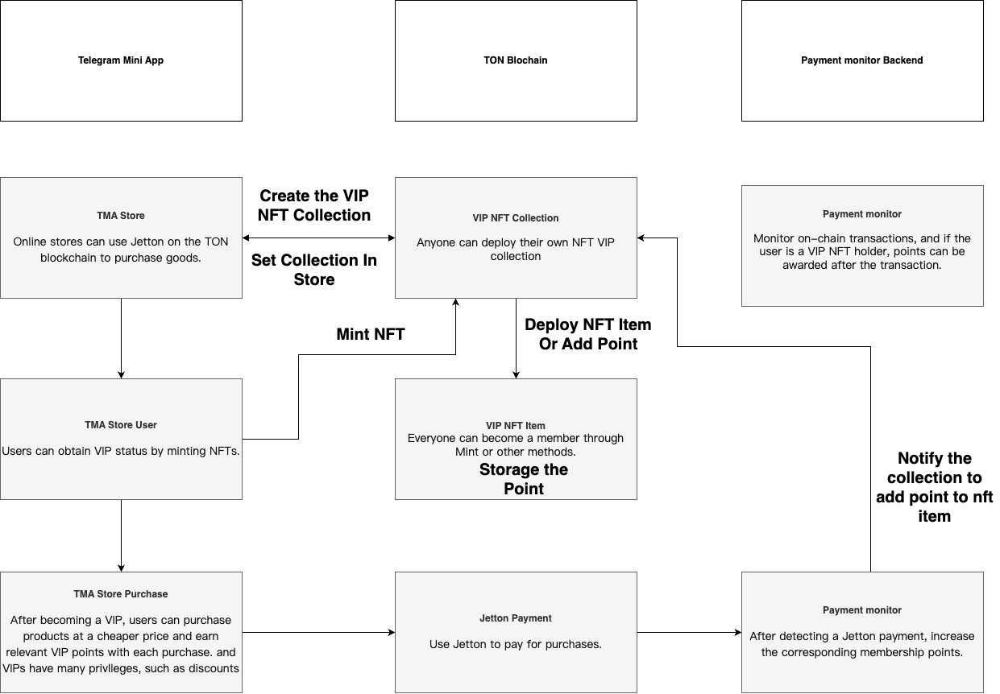

# nftpoint

## Description

The TON VIP Membership Card is a groundbreaking solution designed to enhance the membership experience through the innovative use of blockchain technology. Our platform allows users to collect membership points every time they purchase a product, with additional benefits for those who own our exclusive VIP NFT. These points can be redeemed for a variety of rewards, creating a more engaging and rewarding experience for our members.

Our NFT membership cards offer a secure and transparent way to manage loyalty programs, ensuring that members’ benefits are protected and easily accessible. By integrating with the TON blockchain, we provide a decentralized and tamper-proof system that guarantees the authenticity and value of each membership card.

Join us in redefining the future of loyalty programs, where your membership truly matters and every transaction adds value to your experience.

## Flow

1. User Mint or Become VIP
2. VIP User can get points for each purchase and discount
3. Backend to monitor the jetton purchase and to give points (through the NFT Collection contract, so backend have NFTcollection owner private key)
4. The point can have more usage in the future, like redeeming for discount, etc.

DemoTMA: t.me/nftpoint_bot/pointstore
Test Account mnemonics :
"fruit rescue web moral pluck coin step thought brisk life engine oak travel universe ladder grit carry item until mammal exclude cement among uphold"

## Project structure

-   `app` - the frontend of the project, using React and TonConnect UI.
-   `contracts` - source code of all the smart contracts of the project and their dependencies.
-   `wrappers` - wrapper classes (implementing `Contract` from ton-core) for the contracts, including any [de]serialization primitives and compilation functions.
-   `tests` - tests for the contracts.
-   `scripts` - scripts used by the project, mainly the deployment scripts.

## How to use

### Build

`npx blueprint build` or `yarn blueprint build`

### Test

`npx blueprint test` or `yarn blueprint test`

### Deploy or run another script

`npx blueprint run` or `yarn blueprint run`

### Add a new contract

`npx blueprint create ContractName` or `yarn blueprint create ContractName`
